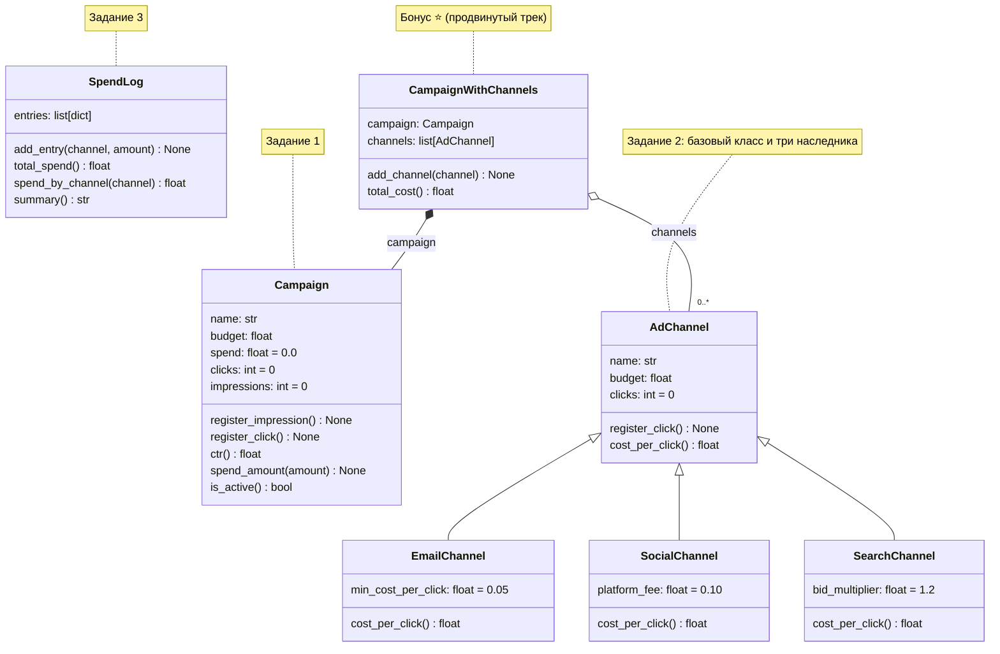

# ДЗ3 - «Рекламная платформа» (ООП)

## Сюжет

Тот же junior-аналитик, что разбирался с утечкой данных в ДЗ1 и приводил в
порядок код ИИ-ассистента в ДЗ2, теперь проектирует ядро маленькой
рекламной платформы: кампании, которые сами знают свой CTR и бюджет,
каналы с разной логикой стоимости клика, отчётность о расходах. Когда
данных и поведения становится много, объект удобнее россыпи функций и
словарей - в этом и есть смысл ООП здесь.

## Формат: как читать диаграммы

Каждое задание задаётся текстовой схемой класса в `diagrams/` - это не
готовый код, а контракт: какие атрибуты и методы должны быть у класса,
какого они типа и что делают. Пример:

```
class Campaign:
    attrs:
        name: str
        budget: float
        spend: float = 0.0        # значение по умолчанию
    methods:
        __init__(self, name: str, budget: float)

        spend_amount(self, amount: float) -> None
            # мутирует: spend += amount

        is_active(self) -> bool
            # возвращает spend < budget
```

Легенда:
- `attrs:` - атрибуты экземпляра (в `__init__` присваиваются `self.<имя>`).
  `= значение` - значение по умолчанию, если параметр не передали.
- `methods:` - методы с сигнатурой как в Python и docstring-комментарием,
  что метод делает.
- **«мутирует»** значит метод меняет состояние объекта (`self.что-то = ...`)
  и обычно возвращает `None`. **«возвращает»** значит метод ничего не
  меняет, а вычисляет и отдаёт значение. Это разные вещи, и в тестах это
  разделение проверяется отдельно - не перепутайте.

Наследование в диаграмме показано как `class EmailChannel(AdChannel):` -
как и в Python: наследник ОБЯЗАН вызвать `super().__init__(...)`, чтобы
получить атрибуты родителя, иначе тесты на них не пройдут.

## Общая схема классов

Та же информация, что в `diagrams/`, но картинкой: видно, какие классы есть
в домашке и как они связаны. Что именно делает каждый метод, по-прежнему
смотрите в текстовых схемах и докстрингах.



Как читать стрелки:
- `AdChannel ◁── EmailChannel` (пустой треугольник) - **наследование**:
  `EmailChannel` является `AdChannel`, то есть `class EmailChannel(AdChannel)`;
- `CampaignWithChannels ◆── Campaign` и `◇── AdChannel` (ромб) -
  **композиция**: `CampaignWithChannels` содержит кампанию и список каналов в
  своих атрибутах, но сам ни кампанией, ни каналом не является;
- `0..*` - каналов может быть сколько угодно, в том числе ни одного.

## Как сдавать

Классы пишутся в `task1.py`-`task3.py` (обязательные) и `task_bonus.py`
(бонус, продвинутый трек). Имена классов, атрибутов и методов менять
нельзя - по ним вас проверяет автотестирование. Замените `...` в теле
метода на реализацию. Задание 4 (`task4.py`) устроено иначе: код в нём уже
написан, но с ошибками, и его нужно починить.

В конце каждого файла - блок `if __name__ == "__main__":`, уже написан,
помогает проверить себя локально:

```bash
python task1.py
```

Реализуйте классы, закоммитьте и запушьте - GitHub Actions прогонит
проверку автоматически, балл появится в summary запуска в разделе Actions.

Локально можно (и стоит) прогнать публичные тесты:

```bash
pip install -r requirements.txt
pytest public_tests/
```

**Важно:** публичные тесты - это только дымовая проверка на очевидных
случаях. Они не покрывают все ситуации, которые проверяет реальная система
оценки (структура классов, наследование, поведение на краевых случаях).

## Задание 1. Класс Campaign

Файл `task1.py`, диаграмма `diagrams/task1_campaign.txt`. Кампания сама
считает свой CTR и знает, активна ли она (бюджет ещё не исчерпан).
Внимательно прочитайте докстринги - какие методы меняют состояние, а какие
только вычисляют и возвращают значение.

## Задание 2. Иерархия каналов AdChannel

Файл `task2.py`, диаграмма `diagrams/task2_channels.txt`. Базовый класс
`AdChannel` и три канала (`EmailChannel`, `SocialChannel`, `SearchChannel`)
с разной логикой `cost_per_click()` - один и тот же вызов на разных
объектах даёт разный результат по формуле каждого канала.

## Задание 3. Рефакторинг в класс SpendLog

Запустите `python procedural_code.py` - рабочий, но процедурный трекер
расходов: данные (список записей) и функции существуют отдельно друг от
друга. Задача - переписать эту логику как класс `SpendLog` в `task3.py`,
диаграмма `diagrams/task3_spendlog.txt`.

## Задание 4. Класс от ассистента

Файл `task4.py`: классы `Audience` и `PremiumAudience`.

Как в задании 5 из ДЗ1, только теперь с классами. ИИ-ассистент написал по
описанию сегмент аудитории для рассылок и его премиальную версию. Код
выглядит аккуратно, но работает неправильно. Докстринги - это то, что у
ассистента просили сделать, и им можно доверять. Код - то, что он написал,
и ему доверять нельзя.

Найдите, где код расходится с докстрингами, и исправьте. Баги могут быть в
любом месте класса, в том числе вне методов. Начните с `python task4.py` - он
печатает результат рядом с ожидаемым. Многие ошибки в классах проявляются,
только когда объектов больше одного, - проверяйте на нескольких сегментах
сразу.

## Критерии оценки

Каждое задание проверяется независимым набором скрытых тестов - вы не
видите ни сами тест-кейсы, ни ожидаемые значения. Итоговый балл - среднее по
заданиям: все обязательные задания весят одинаково, а внутри задания балл -
доля его пройденных тестов. Если файл задания не запускается (например, из-за
синтаксической ошибки), это задание получит 0, но остальные засчитаются.
Задания 1-4 не завязаны друг на друга жёстко - если одно не получилось,
переходите к следующему.

## Задание со звёздочкой (продвинутый трек)

Файл `task_bonus.py`, диаграмма `diagrams/task_bonus_composition.txt`. Не
отдельная тема, а более строгий контракт на тех же классах:

1. Добавьте `__repr__` и `__eq__` прямо в свой класс `Campaign` в
   `task1.py`.
2. Напишите `CampaignWithChannels` в `task_bonus.py` - класс, который
   **содержит** список каналов (`AdChannel`) вместо наследования от них и
   агрегирует по ним метрики. Это композиция: `CampaignWithChannels` не
   является каналом, а делегирует расчёты своим каналам.

Не входит в обязательный балл: в Actions результат бонуса проверяется
отдельным шагом, который не блокирует основную проверку. Бонус использует
классы из заданий 1 и 2 - сначала должны работать они.
